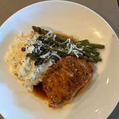

# Brown Sugar Glaze Pork with Asparagus Tips and Mashed Potatoes

## Ingredients

- 1 pork chop

### Glaze

- 3 tsp water
- 3 tsp soy sauce
- 5 tsp brown sugar
- 1 clove garlic, minced
- 1/4 tsp ginger, grated

### Mashed potatoes

- 3 small red potatoes
- 3 tbsp butter
- 1 splash heavy cream
- 1 clove garlic, minced

### Asparagus

- 1 drizzle olive oil
- salt
- pepper
- garlic powder
- Parmigiano Reggiano

## Directions

1. Dry the pork chop, season with salt and pepper, and set aside for 15 minutes.
2. Cut the potatoes into 1/2 inch cubes and boil for 25 minutes.
3. Cook the pork chop 4 to 5 minutes each side until 135 °F.
4. Cut the heat, add the glaze ingredients, let boil, baste, and reduce until glossy. Make sure the pork temps to 145 °F.
5. Toss the asparagus tips in oil, salt, pepper, and garlic powder. Air fry at 400 °F for about 8 minutes (be aware of the fire alarm).
6. Mash the potatoes. Add the heavy cream, salt, butter, and minced garlic.
