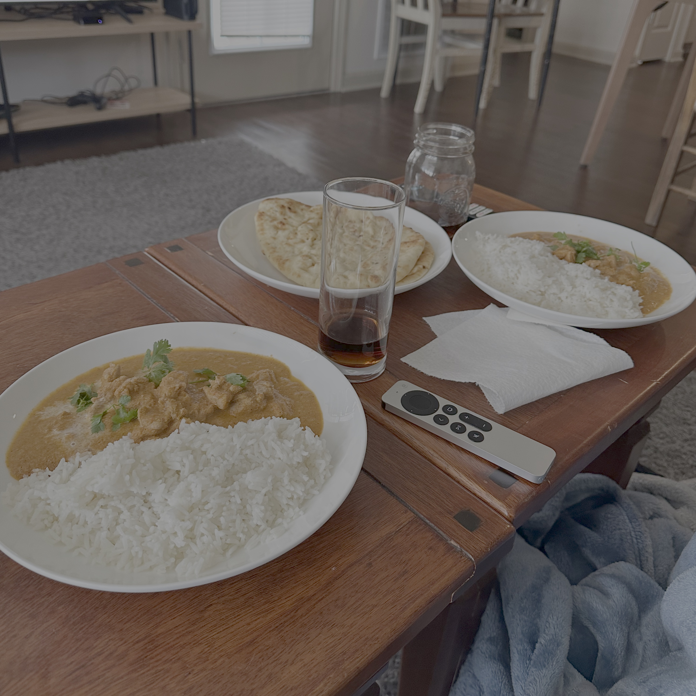

# Butter Chicken

## Ingredients

500g chicken thighs, cut into 1" cubes

### Marinade I

- 0.5 lemon's worth of juice
- 0.5 tsp red chili powder
- 0.25 tsp salt

### Marinade II

- 0.3 cp whole milk greek yogurt
- 0.5 tbsp ground ginger
- 1 tsp garam masala
- 0.5 tsp cumin
- 1 tsp ground coriander
- 1 tbsp olive oil

### Puree

- 130g sliced onion (~0.5 onions)
- 600g fresh tomatoes, cubed (~5 tomatoes)
- 42g whole, raw cashews

### Sauce

- 3 tbsp butter
- 2 inches of cinnamon stick
- 4 whole cardamoms
- 4 whole cloves
- 1 tsp garam masala
- 1 tsp ground coriander
- 0.5 tsp cumin
- 0.5 tsp salt

### Finishing

- 1 pinch salt
- 1 tsp sugar
- 1 tbsp garam masala
- 4 tbsp butter
- 0.3 cp heavy cream
- fresh cilantro

## Directions

### Marinade I

1. Combine the ingredients in a bowl with the cubed chicken.
2. Marinate in the fridge for 20 minutes.

### Marinade II

1. Add the yogurt and mix, then add the seasoning and oil.
2. Marinate 12 hours in the fridge.

### Puree

1. Soak the cashews in warm water for 15 minutes.
2. Sauté the onions for 5 to 7 minutes.
3. Add the tomatoes to a blender and blitz until smooth.
4. Add the onions and continue blending until smooth.
5. Add the soaked cashews and blend until smooth.

### Sauce

1. Melt the butter in a pan over medium heat and add the cinnamon stick, cloves, and whole coriander.
2. When they begin to sizzle, stir in the ginger garlic paste. Fry on low heat for a minute or two, until fragrant but not burnt.
3. Turn off the heat and stir in the garam masala, cumin, and coriander powder.
4. Stir in the puree. If it is not smooth, strain it.
5. Mix well and cover partially. Bring to a boil over medium-high heat, then reduce to low or medium. Cook until the puree turns thick, stirring occasionally.
6. Pour in hot water and simmer for 10 minutes, until the sauce thickens and traces of fat are visible on top. Remove the whole spices and discard.

### Chicken

1. Heat a cast iron pan over medium heat until ripping hot.
2. Add 1 tbsp butter and the chicken, then cook until no marinade is left. The chicken does not need to be fully cooked through.

### Finishing

1. Add the chicken to the sauce. Pour in more hot water (0.5 cp) if the sauce is too thick. Cover and simmer 5 to 7 minutes until tender.
2. Stir in the salt, sugar, butter, and garam masala.
3. Turn off the heat and stir in the heavy cream.
4. Garnish with chopped cilantro and a drizzle of heavy cream. Serve with jasmine rice.

## Notes

> **TODO:** The sauce directions call for ginger garlic paste and whole coriander, and step 6 calls for hot water, but none of the three appear in the ingredient list. Add quantities next time you cook this.
