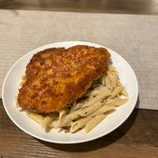

# Crispy Chicken with Creamy Mushroom Pasta

## Ingredients

- 2 chicken breasts, pounded to 1 inch
- 1/3 cp flour
- 1 cp panko
- 1 egg
- 1/2 tsp msg
- 1/2 tsp garlic powder
- 1/2 tsp kosher salt
- 1/4 tsp black pepper
- 1 cp heavy cream
- 1 cp Parmigiano Reggiano, grated
- 6 oz cremini mushrooms, finely diced
- 1 shallot, finely diced
- 2 tbsp unsalted butter
- 1 pinch fresh thyme leaves
- 3 cloves garlic, minced
- 1/2 cp dry vermentino
- 1/2 lb penne or rigatoni

## Directions

1. In a large bowl, combine the panko, msg, garlic powder, salt, and black pepper. Whisk the egg in a smaller bowl with a splash of water and a pinch of msg. Put the flour in a bag and season with a pinch of salt and pepper.
2. Dice the mushrooms and shallots.
3. Heat a few tbsp of oil in a pan. Toss the pounded chicken breasts in flour, then egg, then panko, then lay them in the oil to fry for a few minutes each side until golden and temped. Remove and set on a wire rack.
4. Midway through cooking the chicken, boil salted water in a large pot and add the pasta. Cook according to the box (~12 min).
5. Once the chicken is finished, remove the oil, clean any burnt bits, add 1 tbsp oil, and melt the unsalted butter. Add the mushrooms so they evenly coat the pan, and cook ~8 min until browned.
6. Add the shallots and cook ~3 min. Add the garlic and thyme for around 30 seconds until aromatic. Deglaze with the wine and let it reduce by half (~3 min).
7. Add the heavy cream and cheese, and stir until combined into the sauce. Add the pasta and toss.
8. Slice the chicken and lay it atop the pasta on the plate.
