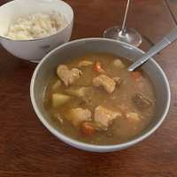

# Japanese Curry

## Ingredients

- 1 lb chicken breasts
- 1 large onion
- 2 carrots, chopped
- 2 medium potatoes, chopped
- 2 cloves minced garlic
- 1 tsp grated ginger
- 3 cp dashi stock
- 1.5 tsp soy sauce
- 0.5 tsp Kioke Shoyu
- 1 tbsp white miso
- 1 tbsp Worcestershire sauce
- 1.5 tbsp ketchup
- 1.5 tsp sugar
- 0.5 tsp cumin
- 0.5 tsp coriander
- 0.25 tsp smoked paprika
- pinch nutmeg
- pinch chili powder
- 2 tbsp butter
- 2 tbsp flour

## Directions

1. Cut the chicken into bite-sized chunks, lightly salt, and set aside.
2. Heat oil in a medium pot over medium heat.
3. Add the sliced onions and a pinch of salt.
4. Cook 10-15 min, stirring occasionally, until soft, lightly golden, and jammy.
5. Add the garlic and ginger, cook another 30-45 seconds.
6. Add the chicken to the pot and cook until the outside turns opaque.
7. Add the carrots, potatoes, and enough dashi stock to cover.
8. Simmer 15-20 minutes, until the veg is tender.
9. While it's simmering, make the roux by melting the butter in a small pan and adding the flour, cooking 1-2 minutes and stirring constantly until a light blonde color.
10. Add the cumin, coriander, smoked paprika, and nutmeg. Toast 30 seconds.
11. Stir the roux into the pot, then add the Worcestershire sauce, ketchup, sugar, and soy sauce. Simmer 5-10 minutes, stirring occasionally until thickened.
12. Turn the heat to low.
13. In a small bowl, mix the white miso with a ladle of the broth, then stir back into the pot.
14. Add 0.5 tsp Kioke Shoyu.
15. Serve with jasmine rice.

## Notes

> **TODO:** The ingredient list includes a pinch of chili powder, but no step calls for it.
