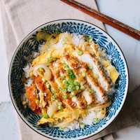

# Katsudon (Japanese Pork Cutlet and Egg Rice Bowl)

Katsudon is a fried, panko-breaded pork cutlet with egg over rice and a favorite of Japanese restaurant-goers.

## Ingredients

- 2 center-cut boneless pork chops, pounded down to a centimeter thick
- salt and pepper
- flour, for dusting
- 1 egg
- 1 cup panko
- oil, for frying
- 1/2 cup dashi stock or chicken stock
- 2 teaspoons sugar
- 1 tablespoon soy sauce
- 2 teaspoons mirin
- 2 large eggs
- 1 medium onion, thinly sliced
- 2 servings steamed white rice
- 1 scallion, chopped

## Directions

1. Season the pounded pork chops with salt and pepper, and dust with a light, even coating of flour. In one shallow bowl, beat the egg. Put the panko into another shallow bowl.
2. Add a thin, even layer of oil to a cast iron pan or skillet over medium heat. The oil is ready when you throw a panko breadcrumb into the oil and it sizzles. Dip the pork into the egg to coat. Transfer the pork to the panko and press it evenly into the meat to get a good coating.
3. Carefully lay the pork chops in the hot oil and cook for 5-6 minutes on one side, until golden brown. Flip and cook the other side for another 5-6 minutes. Drain on a plate lined with a paper towel.
4. While the pork is resting, add the stock, sugar, soy sauce, and mirin to a small bowl. In another bowl, lightly beat 2 eggs. Add a tablespoon of oil to a pan over medium heat, and add the sliced onion. Fry the onions until they're translucent and slightly caramelized.
5. Pour the stock mixture over the onions. Slice your tonkatsu into pieces and place on top of the onions. Drizzle the egg over everything. Cook over medium low heat until the egg is just set. Serve over bowls of steamed rice, and garnish with scallions.
