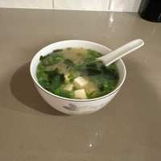

# Miso Soup

## Ingredients

- 2 cp water
- 1 dashi bag
- 1 green onion
- pinch dried wakame
- 1/2 block firm tofu
- 1.5 tbsp white miso

## Directions

1. Bring the water to a simmer and add the dashi bag. Stir and poke to saturate. Steep for 3 minutes, then remove and discard.
2. Keep the stock around a simmer. Good to cut the heat and cover with a lid.
3. Stir in the white miso, whisking until dissolved.
4. Add small flakes of dried wakame. It'll expand in the water 10x.
5. Cut the tofu into cubes and add.
6. Thinly slice the green onions, add, and serve.
