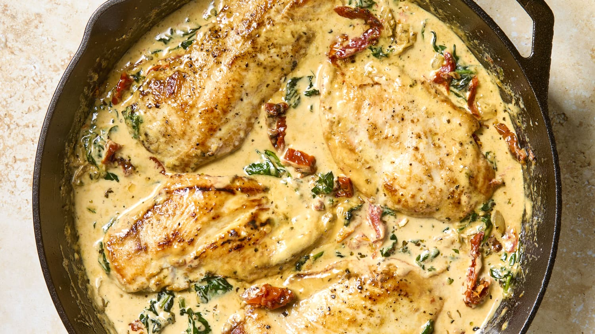

# One-Pan Tuscan Chicken

This tender chicken cooked in a creamy sauce with sun-dried tomatoes and spinach is totally irresistible.

## Ingredients

- 2 large boneless, skinless chicken breasts (1 1/2 to 2 pounds total)
- 1 1/2 teaspoons kosher salt, divided
- 1/2 teaspoon freshly ground black pepper
- 2 to 3 tablespoons olive oil, divided
- 1 small yellow onion, diced (about 2/3 cup)
- 3 cloves garlic, minced
- 1/2 cup drained oil-packed sun-dried tomatoes (2 1/2 ounces), thinly sliced
- 2 teaspoons dried Italian seasoning
- 5 ounces baby spinach (about 5 packed cups)
- 1 ounce Parmesan cheese (1/2 cup firmly packed freshly grated or 1/3 cup store-bought grated)
- 1 1/4 cups heavy cream

## Directions

1. Cut the chicken breasts in half horizontally (butterflying). Pat dry with paper towels. Season all over with 1 teaspoon of the kosher salt and the black pepper.
2. Heat 1 tablespoon of the olive oil in a large skillet over medium-high heat until shimmering. Add half of the chicken in a single layer and sear until browned, 3 to 5 minutes per side. Transfer to a large plate — the chicken will not be cooked through. Add another 1 tablespoon of the olive oil to the pan and repeat with the remaining chicken. Transfer to the same plate.
3. Reduce the heat to medium. Add the remaining 1 tablespoon olive oil, if needed, and heat until shimmering. Add the diced onion and cook, stirring occasionally, until softened, 2 to 3 minutes. Add the garlic, sun-dried tomatoes, and Italian seasoning. Cook until fragrant, 30 seconds to 1 minute. Add the baby spinach a handful at a time. Cook, stirring regularly, until just wilted, 1 to 2 minutes.
4. Add the Parmesan, heavy cream, and the remaining 1/2 teaspoon kosher salt. Bring to a simmer, scraping up any browned bits from the bottom of the pan with a wooden spoon. Reduce the heat to maintain a gentle simmer. Return the chicken and any accumulated juices to the pan and cook until the chicken registers at least 165 °F on an instant-read thermometer, 4 to 7 minutes.

## Notes

Refrigerate leftovers in an airtight container for up to 4 days.
