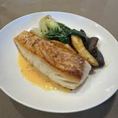

# Pan-Seared Halibut with a Lemon Beurre Blanc, Baby Bok Choy, and Roasted Fingerling Potatoes

## Ingredients

- 2 halibut fillets
- 2 baby bok choy
- 1/2 cp vermentino wine
- 1 shallot, minced
- 8 + 2 tbsp butter
- 1/2 lemon, juiced
- 1 cp fingerling potatoes, quartered

## Directions

1. Toss the quartered fingerling potatoes in olive oil, salt, pepper, smoked paprika, and msg. Bake at 400 °F for ~18 min.
2. Add the shallots, wine, and lemon juice to a sauce pan over medium heat until reduced.
3. Heat olive oil in another sauce pan over high heat. Add the halibut (patted dry with a sprinkle of salt) and let sear (~5 min), then flip and add 2 tbsp butter and a bit of minced garlic. Baste until the fish reaches 130 °F internally (~2 more minutes), then remove and set aside.
4. Mount 8 tbsp butter into the sauce to finish the beurre blanc. Strain into a ramekin.
5. Add the quartered baby bok choy to the pan until each side has color.
6. Plate the fish above the sauce, with the veg and potatoes.

## Notes

> **TODO:** The directions call for olive oil, salt, pepper, smoked paprika, msg, and minced garlic, none of which are in the ingredient list. Add quantities next time you cook this.
