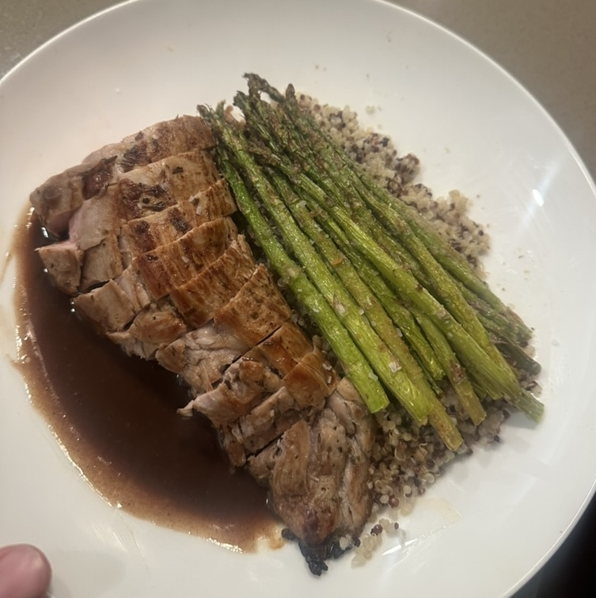

# Red Wine Rosemary Fig Sauce for Pork

## Ingredients

- 0.5 shallot, finely diced
- 1 clove garlic, minced
- 60 ml water
- 80 ml pinot noir
- 0.5 tbsp fig jam
- 1 rosemary sprig
- 0.5 tbsp soy sauce
- 35g cold butter, cubed

## Directions

1. Add a splash of water to the pork pan and scrape up the fond.
2. Add the shallot and a bit of butter. Cook for a few minutes until softened.
3. Add the garlic and cook another 5 minutes.
4. Add the wine and reduce until dragging a spoon through leaves a bare trail for a few seconds.
5. Add the water, fig jam, soy sauce, and rosemary sprig. Simmer until it coats the back of a spoon.
6. Pull off the heat and mount with the butter.
7. Strain through a sieve to remove the solids.
