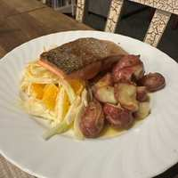

# Salmon with Baby Potatoes and Fennel Citrus Salad, and Lemon Butter Sauce

## Ingredients

- 0.5 bulb fennel
- 1 navel orange
- 1 lemon
- 1 portion salmon
- 2 tsp champagne white wine vinegar
- 1 tbsp finishing olive oil
- a few sprigs of thyme
- 4 tbsp butter
- 0.25 cp dry white wine

## Directions

1. Dry and salt the salmon for 15-30 minutes prior to cooking.
2. Preheat the oven to 425 °F.
3. Add the baby potatoes to salted cold water and boil ~12 minutes. Drain and let steam dry.
4. Toss with olive oil, salt, and pepper. Slightly crush with a fork on a baking sheet. Bake ~20 min.
5. Thinly slice the fennel and add to a bowl. Peel, separate, and add the orange. Supreme and add 0.5 lemon.
6. Toss the salad in the champagne white wine vinegar and finishing olive oil with a pinch of salt for at least 10 minutes.
7. Pat the salmon very dry, heat oil in a pan over medium high heat. Add the salmon skin side down. Press around 30 seconds. Cook ~4 minutes, then flip.
8. Add 1 tbsp butter and the thyme. Baste and finish the salmon.
9. Deglaze the pan with the white wine. Add the juice of a half lemon. Reduce to around 3 tbsp, then add cold butter 1 tbsp at a time and stir to emulsify.

## Notes

> **TODO:** Step 3 calls for baby potatoes, but they are missing from the ingredient list along with the olive oil, salt, and pepper used in steps 4 and 7.
