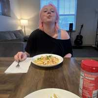

# Shrimp Scampi

## Ingredients

- 1/2 lb pasta
- 1/2 lb large shrimp, peeled and deveined
- 2 tbsp olive oil
- 6 cloves garlic, minced
- 1/2 cup dry white wine
- pinch red pepper flakes
- juice of 1/2 lemon, plus wedges for serving
- 4 tablespoons butter, cut into pieces
- 1/4 cup finely chopped fresh parsley

## Directions

1. Bring a large pot of salted water to a boil. Add the linguine and cook as the label directs. Reserve 1 cup cooking water, then drain.
2. Meanwhile, season the shrimp with salt. Heat the olive oil in a large skillet over medium-high heat. Add the garlic and red pepper flakes and cook until the garlic is just golden, 30 seconds to 1 minute. Add the shrimp and cook, stirring occasionally, until pink and just cooked through, 1 to 2 minutes per side. Remove the shrimp to a plate. Add the wine and lemon juice to the skillet and simmer until slightly reduced, 2 minutes.
3. Return the shrimp and any juices from the plate to the skillet along with the pasta, butter, and 1/2 cup of the reserved cooking water. Continue to cook, tossing, until the butter is melted and the shrimp is hot, about 2 minutes, adding more of the reserved cooking water as needed. Season with salt, then stir in the parsley. Serve with lemon wedges.
