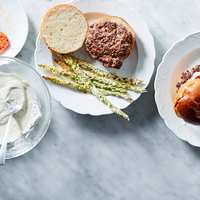

# Turkey Burgers

## Ingredients

- 8 oz turkey 97%
- 8 oz asparagus
- 1 oz feta
- 0.5 tbsp Worcestershire sauce
- 0.5 tsp mustard powder
- 0.5 oz mayo
- 1 slice sourdough
- 1 slice of red onion
- 1 tsp garlic powder
- 1 tsp onion powder
- 0.5 tsp olive oil

## Directions

1. Mix the turkey with salt, pepper, and Worcestershire sauce, and form into a patty.
2. Toss the asparagus with garlic powder, onion powder, salt, and pepper, and bake at 400 °F for 12ish minutes.
3. Mix the mayo, feta, mustard powder, 2 tsp water, salt, and pepper in a dish to make the sauce. Mix, then microwave 10 seconds, then mix again.
4. Cook the patty 3 minutes each side in 0.5 tsp olive oil.
5. Cook the onion slice in the pan after the patty is removed.
6. Assemble and serve.
