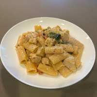

# Tuscan Chicken Rigatoni

## Ingredients

- 1 pound boneless, skinless chicken breasts, cut into 1-inch pieces
- 1 teaspoon kosher salt, divided, plus more as needed
- 1/4 teaspoon freshly ground black pepper
- 2 tablespoons olive oil, divided
- 1 medium shallot, finely chopped (about 1/4 cup)
- 3 cloves garlic, thinly sliced
- 1/2 cp julienne cut sun dried tomatoes
- 1 tablespoon tomato paste
- 1/2 teaspoon dried oregano
- 1 (32-ounce) carton low-sodium chicken broth (4 cups)
- 1 1/2 cups heavy cream
- 1 pound dried rigatoni pasta
- 4 ounces baby spinach (4 packed cups)
- 1/4 cup grated Parmesan cheese, plus more for serving

## Directions

1. Season the chicken pieces with 1/2 teaspoon of the kosher salt and the black pepper.
2. Heat 1 tablespoon of the olive oil in a large Dutch oven over medium heat until shimmering. Add the chicken in a single layer and cook, stirring occasionally, until browned all over, 7 to 9 minutes. Transfer to a bowl (it might not be cooked through).
3. Add the remaining 1 tablespoon olive oil, the shallot, and the garlic to the pot. Cook, stirring occasionally, until fragrant, about 1 minute. Stir in the sun-dried tomatoes, tomato paste, and oregano. Cook, stirring often, until the tomato paste is darkened in color, 1 to 2 minutes.
4. Stir in the chicken broth, heavy cream, rigatoni, and the remaining 1/2 teaspoon kosher salt. Bring to a simmer. Cook, adjusting the heat as needed to maintain a simmer, until the pasta is al dente, 18 to 20 minutes.
5. Reduce the heat to medium-low. Stir in the Parmesan, the chicken, and any accumulated juices in the bowl. Cook, stirring occasionally, until the sauce thickens slightly and coats the pasta, and the chicken is cooked through, about 2 minutes.
6. Stir in the baby spinach until wilted, about 1 minute. Taste and season with kosher salt and black pepper as needed. Serve garnished with more grated Parmesan.

## Notes

> **TODO:** The ingredient list calls for 1/2 cp julienne cut sun-dried tomatoes, but the source directions say "4 thinly sliced sun-dried tomatoes." Confirm which amount you actually use.
